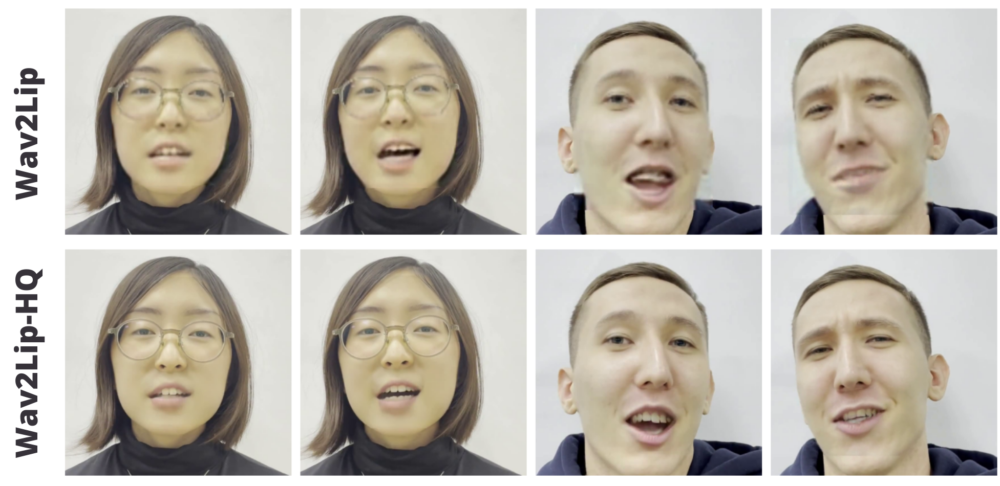

# Wav2Lip-HQ: high quality lip-sync

---

## :exclamation::exclamation: This repository is deprecated, and no one maintains it at this moment. A lot has changed in the field since it was created, and many new instruments have emerged. Please, do not try to use this repository for your practical purposes. :exclamation::exclamation:

---

This is unofficial extension of [Wav2Lip: Accurately Lip-syncing Videos In The Wild](https://github.com/Rudrabha/Wav2Lip) repository. We use image super resolution and face segmentation for improving visual quality of lip-synced videos.

## Acknowledgements
Our work is to a great extent based on the code from the following repositories:

1. Clearly, [Wav2Lip](https://github.com/Rudrabha/Wav2Lip) repository, that is a core model of our algorithm that performs lip-sync.
1. Moreover, [face-parsing.PyTorch](https://github.com/zllrunning/face-parsing.PyTorch.git) repository provides us with a model for face segmentation.
1. We also use extremely useful [BasicSR](https://github.com/xinntao/BasicSR.git) respository for super resolution.
1. Finally, Wav2Lip heavily depends on [face_alignment](https://github.com/1adrianb/face-alignment) repository for detection.

## The algorithm
Our algorithm consists of the following steps:

1. Pretrain ESRGAN on a video with some speech of a target person.
1. Apply Wav2Lip model to the source video and target audio, as it is done in official Wav2Lip repository.
1. Upsample the output of Wav2Lip with ESRGAN.
1. Use BiSeNet to change only relevant pixels in video.

You can learn more about the method in [this article](https://drive.google.com/file/d/1ptTFVNc1v9kzr-V3OK8DJEywziVMKh68/view?usp=sharing) (**in russian**).

## Results
Our approach is definetly not at all flawless, and some of the frames produced with it contain artifacts or weird mistakes. However, it can be used to perform lip-sync to high quality videos with plausible output.



## Running the model

The simpliest way is to use our [Google Colab demo](https://colab.research.google.com/drive/1bwgV-31JLNFTKCVDnJtTbP4brOUV1xaL?usp=sharing). However, if you want to test the algorithm on your own machine, run the following commands. Beware that you need Python 3 and CUDA installed.

1. Clone this repository and install requirements:
    ```
    git clone https://github.com/Markfryazino/wav2lip-hq.git
    cd wav2lip-hq
    pip3 install -r requirements.txt
    ```
1. Download all the `.pth` files from [here](https://drive.google.com/file/d/1aB-jqBikcZPJnFrJXWUEpvF2RFCuerSe/view?usp=sharing) and place them in [checkpoints](checkpoints/) folder. 

    Apart from that, вownload the face detection model checkpoint:
    ```
    !wget "https://www.adrianbulat.com/downloads/python-fan/s3fd-619a316812.pth" -O "face_detection/detection/sfd/s3fd.pth"
    ```
1. Run the inference script:
    ```
    !python inference.py \
        --checkpoint_path "checkpoints/wav2lip_gan.pth" \
        --segmentation_path "checkpoints/face_segmentation.pth" \
        --sr_path "checkpoints/esrgan_yunying.pth" \
        --face <path to source video> \
        --audio <path to source audio> \
        --outfile <desired path to output>
    ```

## Finetuning super-resolution model.

Although we provide a checkpoint of pre-trained ESRGAN, it's training dataset was quite modest, so the results may be insufficient. Hence, it can be useful to finetune the model on your target video. 1 or 2 minutes of speech is usually enough.

To simplify finetuning the model, we provide a [colab notebook](https://colab.research.google.com/drive/1IUGYn-fMRbjH2IyYoAn5VKSzEkaXyP2s?usp=sharing). You can also run the commands listed there on your machine: namely, you have to download the models, run inference with saving all the frames on-the-fly, resize them and train ESRGAN.

Bear in mind that the procedure is quite time- and memory-consuming.
